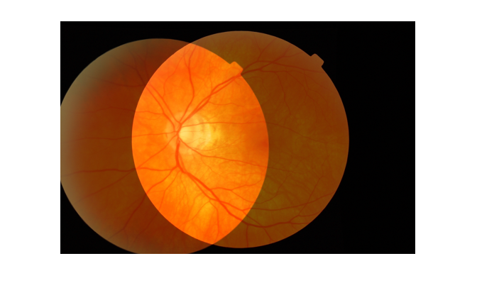

# Gaussian Field Estimator with Manifold Regularization for Retinal Image Registration
<div align=center></div>
## Introduction
Retinal image registration, which combines the information of retinal images from different modalities, viewpoints or times, plays an important role in diagnosing and treating many eye diseases. In this work, we propose an efficient algorithm called <b>Gaussian field estimator with manifold regularization (GFEMR)</b> to address this requirement. We formulate the registration problem as a probabilistic model, that is, a Gaussian field estimator, to achieve a robust estimation, associated with a prior involving manifold regularization to preserve the intrinsic geometry of input data. A non-rigid transformation is specified in a reproducing kernel Hilbert space. Moreover, a sparse approximation is applied to the non-rigid transformation for a fast implementation. Extensive experiments on retinal images show the effectiveness of our approach, which can yield superior results compared with other state-of-the-art methods, especially in the case of severely degraded data.

In this repo, you will find a MATLAB implementation of GFEMR. To try this code, please run "demo.m".
The retinal images in this repo are from the RODREP dataset (http://www.rodrep.com/data-sets.html).

## Citation
If you use our code or models in your research, please cite with:
```
@article{wang2018gaussian,
  title={Gaussian Field Estimator with Manifold Regularization for Retinal Image Registration},
  author={Wang, Jiahao and Chen, Jun and Xu, Huihui and Zhang, Shuaibin and Mei, Xiaoguang and Huang, Jun and Ma, Jiayi},
  journal={Signal Processing},
  year={2018},
  publisher={Elsevier}
}
``` 